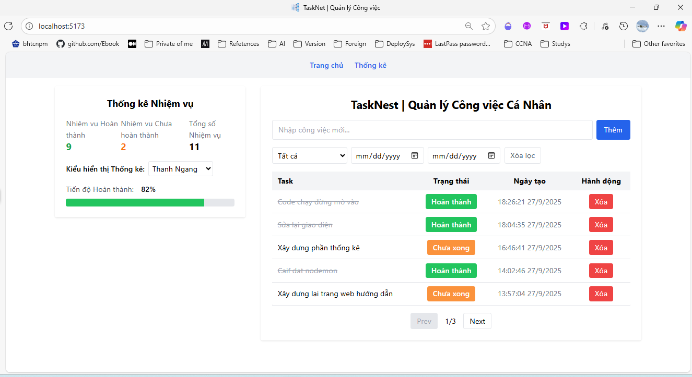
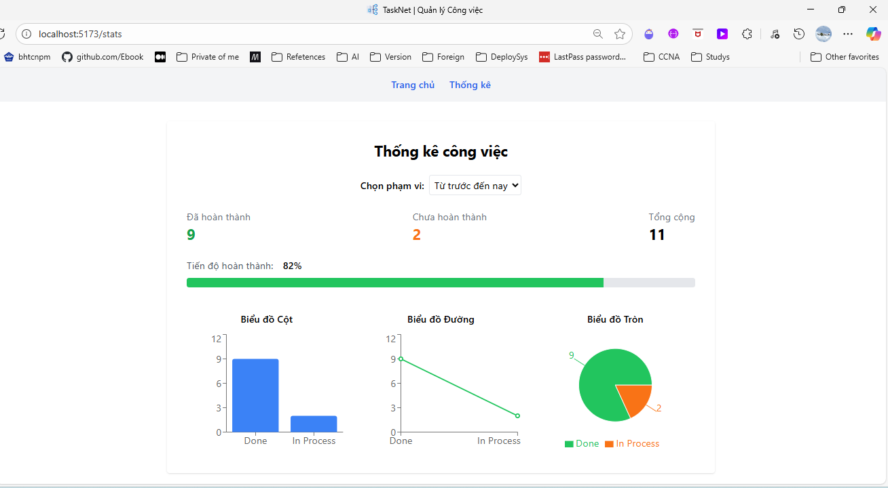

# TaskNest-MERN
Mini Project Quản lý Công việc Cá nhân (Personal Task Management)

---
## Hướng dẫn sử dụng sau khi clone dự án về
---

### 1. Yêu cầu môi trường (Prerequisites)
- **Node.js** >= 16.x  
- **npm** >= 8.x  
- **MongoDB** (cài local hoặc sử dụng **MongoDB Atlas**)  
- **Git** (để clone repository)

---

### 2. Cài đặt Backend

1. Mở terminal và chuyển vào thư mục backend:
    ```bash
    cd server
    ```

2. Cài đặt dependencies:
    ```bash
    npm install
    ```

3. Tạo file `.env` trong thư mục `backend` với nội dung ví dụ:
    ```
    PORT=5000
    MONGO_URI=mongodb://localhost:27017/tasknest
    ```

4. Chạy server backend:
    - Chạy với chế độ dev (tự reload khi sửa code):
      ```bash
      npm run dev
      ```
    - Hoặc chạy bình thường:
      ```bash
      npm start
      ```
    - Hoặc chạy với node:
      ```bash
      node server.js
      ```

---

### 3. Cài đặt Frontend

1. Mở terminal mới, chuyển vào thư mục frontend:
    ```bash
    cd client
    ```

2. Cài đặt dependencies:
    ```bash
    npm install
    ```

3. Chạy ứng dụng React:
    ```bash
    npm run dev
    ```

---

### 4. Truy cập website

Mở trình duyệt và truy cập:  
[http://localhost:5173/](http://localhost:5173/)




---

### 5. Lưu ý (Notes)

- Đảm bảo backend chạy ở **cổng 5000** (hoặc cập nhật API endpoint trong frontend nếu đổi cổng).  
- Nếu sử dụng **MongoDB Atlas**, thay đổi `MONGO_URI` trong file `.env` cho phù hợp.  
- Nếu gặp lỗi **CORS**, kiểm tra cấu hình `cors` trong backend.  
- Nên cài **nodemon** toàn cục để tự reload khi code backend thay đổi:  
  ```bash
  npm install -g nodemon

---

### 6. Deloy project web TaskNest trên vercel
- [https://task-nest-mern-zfa9.vercel.app/](https://task-nest-mern-zfa9.vercel.app/)

---

### 7. Kế hoạch/tiến độ triển khai dự án trên Jira
- [https://student-team-vnphuphm.atlassian.net/jira/software/projects/L0MPNP/boards/232/timeline](https://student-team-vnphuphm.atlassian.net/jira/software/projects/L0MPNP/boards/232/timeline)
- Cumulative flow diagram
[https://student-team-vnphuphm.atlassian.net/jira/software/projects/L0MPNP/boards/232/reports/cumulative?atlOrigin=eyJpIjoiN2Q4ZjZhNTAwZGNkNDdhNjgzOGY2OTBmOGUyNWE0OWEiLCJwIjoiaiJ9](https://student-team-vnphuphm.atlassian.net/jira/software/projects/L0MPNP/boards/232/reports/cumulative?atlOrigin=eyJpIjoiN2Q4ZjZhNTAwZGNkNDdhNjgzOGY2OTBmOGUyNWE0OWEiLCJwIjoiaiJ9)
- Report .csv
[https://drive.google.com/file/d/1aNGZjWRiV5P2qxpGkAVX5ttaxhvbcJp1/view?usp=sharing](https://drive.google.com/file/d/1aNGZjWRiV5P2qxpGkAVX5ttaxhvbcJp1/view?usp=sharing)

---